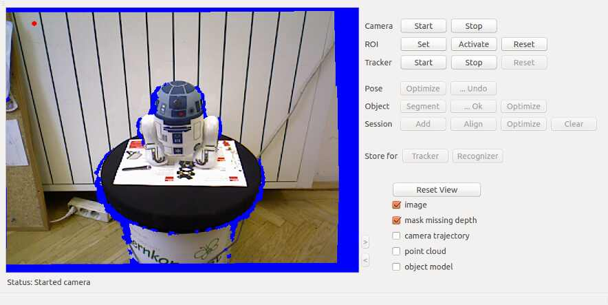
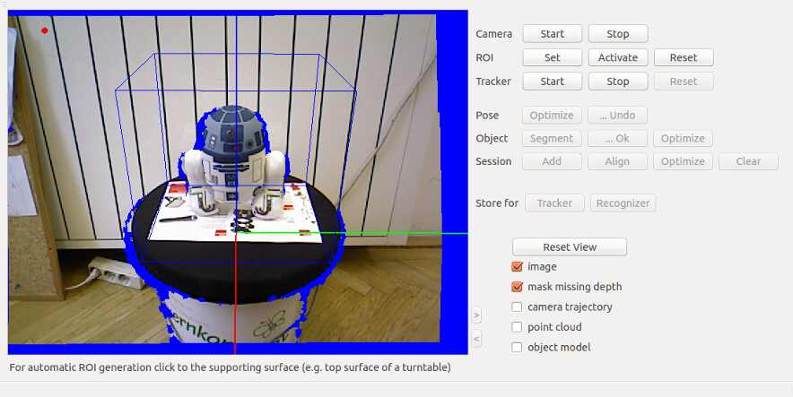
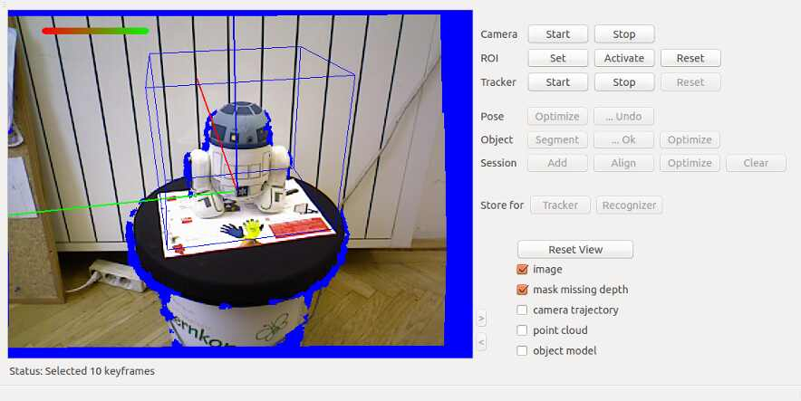
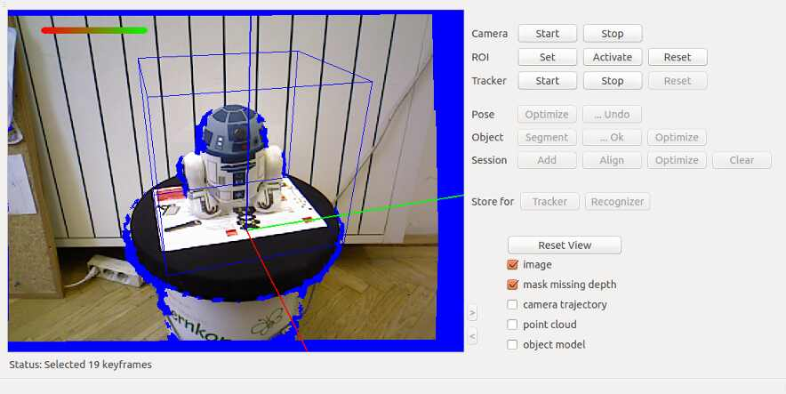
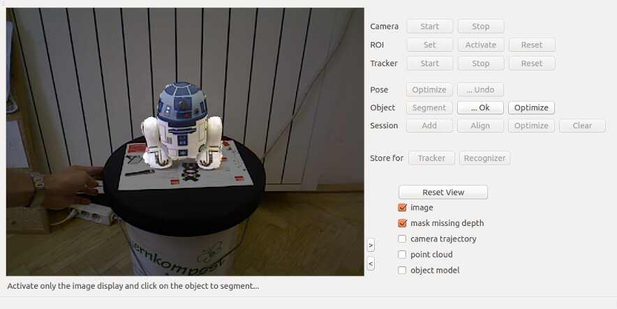
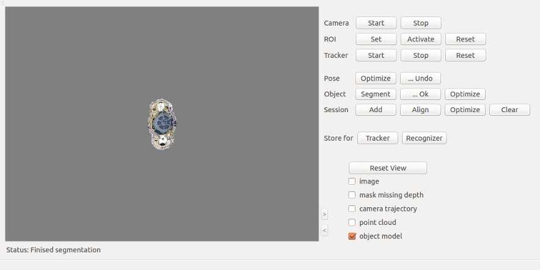
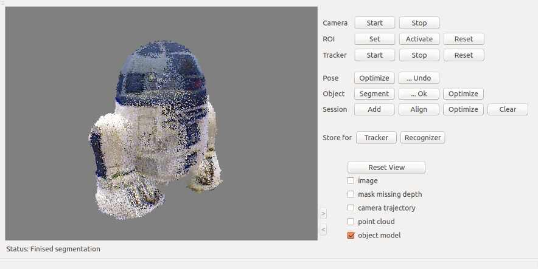
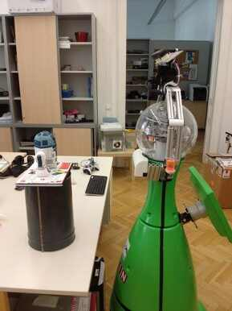

# RTMT Recognition Modeling & Tracking Toolbox

In this tutorial you will learn how to model objects with an RGB-D camera. These 3D models can used for training an object recognizer or used for object tracking

## Object modelling  
* Place the object on a flat surface on a newspaper or something similar. This allows you to rotate the object without touching it. The texture on the newspaper also helps view registration. The pictures below were taken with the object on a turn table, which is the most convenient way of rotating the object. You can also model objects without a turntable by putting the object on the floor for instance and moving your camera. In this case just skip the step definining the ROI.
* Start the modelling tool: ~/somewhere/v4r/bin/RTMT
* Press "Camera Start": You should now see the camera image  
  
* If you use a turntable like shown in the image, select the region of interest by pressing "ROI Set" and clicking on the flat surface next to the object. If you model the object without a turntable, skip this step.  
  
* Press Tracker Start: you now see the tracking quality bar top left  
  
* Rotate 360 degrees, the program will generate a number of keyframes.  
  **IMPORTANT:** Do not touch the object itself while moving it.  Also, if you selected a ROI, try not to move your fingers above the turntable, otherwise it might be added to the object model.  
  
  
* Press "Tracker Stop"
* Press "Camera Stop"
* Press "Pose Optimize" (optional): bundle adjustment of all cameras (be patient!)
* Press "Object Segment": The object should already be segmented correctly thanks to the ROI set previously  
  
  You can check segmentation (< > buttons). Highlighted areas are segments that will be clustered to the object model. If some highlighted areas do not belong to the object (e.g. supporting plane), you can click on these wrong segmentations to undo. You can also click on dark areas to add these segments to the object model. These areas should automatically be projected into the other frames.
* Press "Object ...Ok"  
  
  
* Press "Store for Recognizer": saves the point clouds in a format for object recognition. You will be asked for an model name.  
  By default the program will store models in various subfolders of the folder "./data", which will be created if not present. This can be changed in the configuration options (see below).
* Press "Store for Tracker": save a different model suitable for tracking
* If the 3D point cloud visualization is activated +/- can be used to increase/ decrease the size of dots

This is a convenient way to model objects with the STRANDS robots. Put the objects on something elevated (a trash can in this case) to bring it within a good distance to the robot's head camera.

### Configuration options:  
* Set data folder and model name:  
  (File -> Preferences -> Settings -> Path and model name)
* Configure number of keyfames to be selected using a camera rotation and a camera translation threshold:  
  (File -> Preferences -> Settings -> Min. delta angle, Min. delta camera distance)

### Trouble shooting  
* If you press any of the buttons in the wrong order, just restart. Recovery is futile.
* If you do not get an image, there is a problem with the OpenNI device driver.
Check the file `/etc/openni/GlobalDefaults.ini`, set `UsbInterface=2` (i.e. BULK).
* If the plane supporting the object is not removed completely, try to increase the inlier distance for dominant plane segmentation in File -> Preferences -> Postprocessing.

## References  
When referencing this work, pleace cite:

1. J. Prankl, A. Aldoma Buchaca, A. Svejda, M. Vincze, RGB-D Object Modelling for Object Recognition and Tracking. IEEE/RSJ International Conference on Intelligent Robots and Systems (IROS), 2015.

2. Thomas Fäulhammer, Aitor Aldoma, Michael Zillich and Markus Vincze
Temporal Integration of Feature Correspondences For Enhanced Recognition in Cluttered And Dynamic Environments
IEEE International Conference on Robotics and Automation (ICRA), Seattle, WA, USA, 2015.

3. Thomas Fäulhammer, Michael Zillich and Markus Vincze
Multi-View Hypotheses Transfer for Enhanced Object Recognition in Clutter,
IAPR International Conference on Machine Vision Applications (MVA), Tokyo, Japan, 2015.

4. A. Aldoma Buchaca, F. Tombari, J. Prankl, A. Richtsfeld, L. di Stefano, M. Vincze, Multimodal Cue Integration through Hypotheses Verification for RGB-D Object Recognition and 6DOF Pose Estimation. IEEE International Conference on Robotics and Automation (ICRA), 2013.

5. J. Prankl, T. Mörwald, M. Zillich, M. Vincze, Probabilistic Cue Integration for Real-time Object Pose Tracking. Proc. International Conference on Computer Vision Systems (ICVS). 2013.

For further information check out [this site](http://www.acin.tuwien.ac.at/forschung/v4r/software-tools/rtm).
